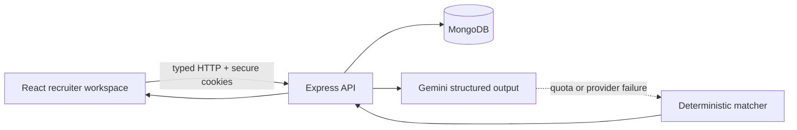
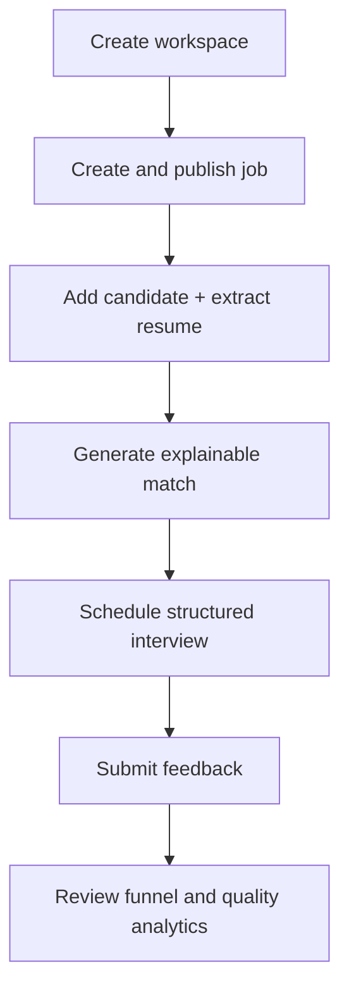

# RecruiterAI OS Architecture

## System shape

The repository is an npm workspace monorepo. `apps/web` contains the React/Vite client,
`apps/api` contains the Express/Mongoose service, and `packages/contracts` is the shared
Zod boundary between them.

## Trust boundaries

- Refresh tokens are signed, HTTP-only cookies. Access tokens live only in React memory.
- Every job, candidate, match, interview, and analytics query includes the authenticated
  owner identifier.
- Resume uploads are limited to one 2 MB PDF or plain-text file and processed in memory.
  The original binary is discarded after extraction.
- AI results are stored with source, model, prompt version, evidence, and rationale.
  Provider failure falls back to deterministic scoring with the same response contract.
- AI output is decision support only; candidate rejection is always a human action.

## Product flow

## Data model

- `User`: account identity, role, organization display name, session version.
- `Job`: requisition details, lifecycle status, skills, compensation, applicant count.
- `Candidate`: account/job assignment, pipeline status, profile, normalized resume text.
- `CandidateMatch`: score, evidence, gaps, source/model metadata, human-review guidance.
- `Interview`: schedule, stage-aware question kit, meeting metadata, structured feedback.

The current portfolio version scopes data to the creating account. A future enterprise
iteration can replace `ownerId` with an organization membership model without changing the
client contracts.
